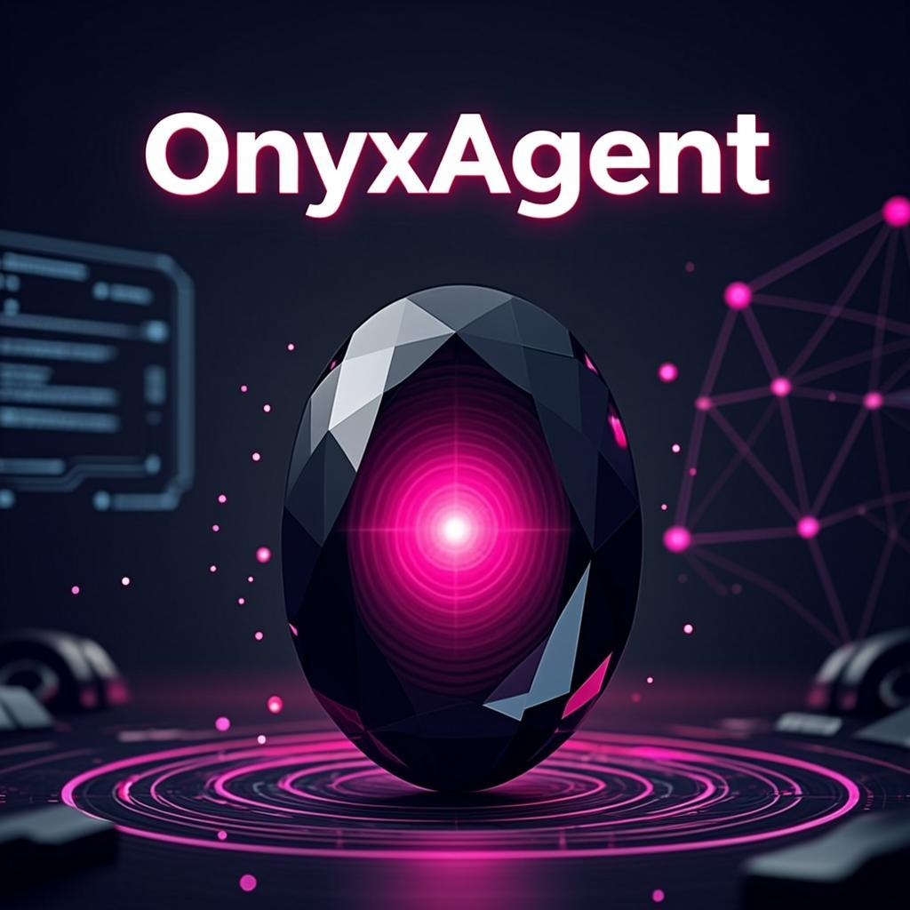
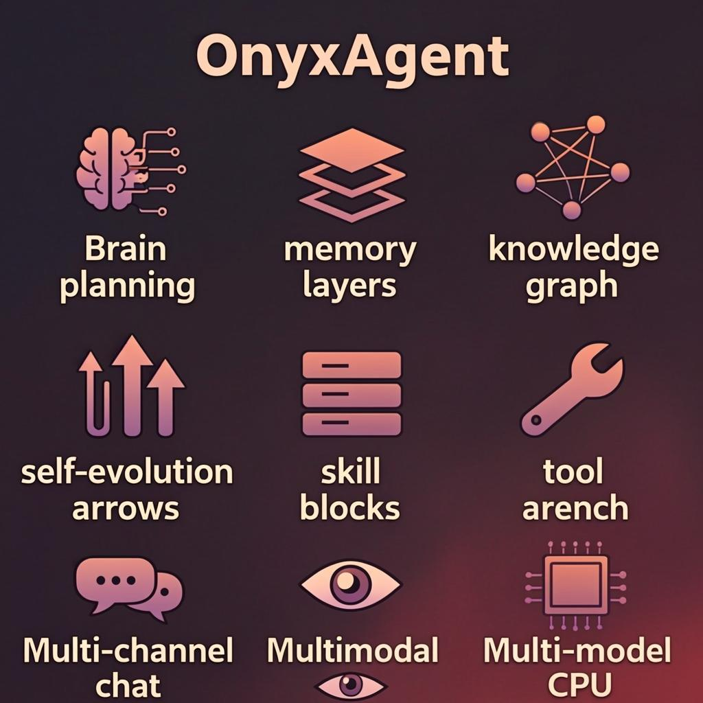
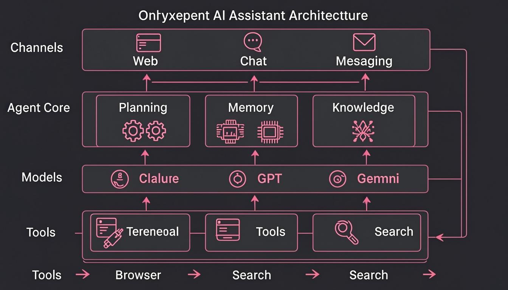
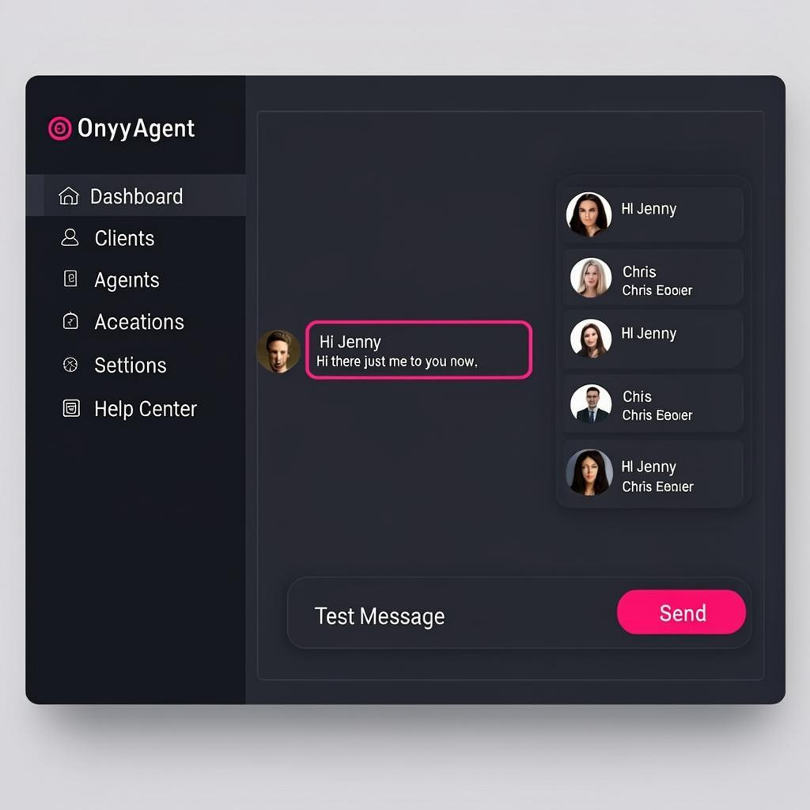

<p align="center">
  
</p>

<p align="center">
  <a href="https://github.com/AkshayCoder48/OnyxAgent/releases/latest"></a>
  <a href="https://github.com/AkshayCoder48/OnyxAgent/blob/main/LICENSE"></a>
  <a href="https://github.com/AkshayCoder48/OnyxAgent"></a>
  <a href="https://onyxagent-docs.vercel.app"></a>
  <a href="https://huggingface.co/spaces/Isushsbshsh/OnyxAgent"></a>
  
</p>

<p align="center">
  [English] | [<a href="docs/zh/README.md">中文</a>] | [<a href="docs/ja/README.md">日本語</a>]
</p>

**OnyxAgent** is an open-source super AI assistant that proactively plans tasks, controls your computer and external services, creates and runs Skills, builds a personal knowledge base and long-term memory, and grows alongside you through self-evolution — a reference implementation of Agent Harness engineering.

OnyxAgent is lightweight, easy to deploy, and built to extend. Plug in any major LLM provider and run it 24/7 on a personal computer or server, across the web and all major IM platforms.

<p align="center">
  <a href="https://onyxagent-docs.vercel.app">📚 Docs</a> &nbsp;·&nbsp;
  <a href="https://huggingface.co/spaces/Isushsbshsh/OnyxAgent">🎮 Demo</a> &nbsp;·&nbsp;
  <a href="https://github.com/AkshayCoder48/OnyxAgent">🌐 GitHub</a> &nbsp;·&nbsp;
  <a href="https://github.com/AkshayCoder48/OnyxAgent#-quick-start">🚀 Quick Start</a> &nbsp;·&nbsp;
  <a href="https://github.com/AkshayCoder48/OnyxAgent#-architecture">📖 Architecture</a> &nbsp;·&nbsp;
  <a href="https://github.com/AkshayCoder48/OnyxAgent#-models">🤖 Models</a>
</p>

<br/>

## 🌟 Highlights

<p align="center">
  
</p>

| Capability | Description |
| :--- | :--- |
| [Planning](#-architecture) | Decomposes complex tasks and executes them step by step, looping over tools until the goal is reached |
| [Memory](#-memory--knowledge-base) | Three-tier architecture (context → daily → core), automatic Deep Dream distillation, hybrid keyword + vector retrieval |
| [Knowledge](#-memory--knowledge-base) | Auto-curates structured knowledge into a Markdown wiki, builds an evolving knowledge graph with visual browsing |
| [Evolution](#-tools--skills) | Self-Evolution reviews conversations automatically to improve skills, follow up on unfinished tasks, and consolidate memory and knowledge, growing through everyday use |
| [Skills](#-tools--skills) | One-click install from Skill Hub, GitHub; or create custom skills via natural-language conversation |
| [Tools](#-tools--skills) | Built-in file I/O, terminal, browser, scheduler, memory retrieval, web search, and 10+ more tools — with native MCP support via terminal |
| [Channels](#-channels) | Integrates with Web, WeChat, Feishu, DingTalk, WeCom, QQ, Official Accounts, Telegram, and Slack |
| Multimodal | First-class support for text, images, voice, and files — recognition, generation, and delivery |
| [Models](#-models) | Claude, GPT, Gemini, DeepSeek, Qwen, GLM, Kimi, MiniMax, Doubao, and more — swap providers from the Web console with one click |

<br/>

## 🏗️ Architecture

<p align="center">
  
</p>

OnyxAgent is a complete **Agent Harness**: messages flow in through **Channels**; the **Agent Core** plans and reasons over memory, knowledge, and the available tools and skills; **Models** generate the response, which is sent back through the originating channel. Every layer is decoupled and independently extensible.

<br/>

## 🚀 Quick Start

### Clone & Install

```bash
git clone https://github.com/AkshayCoder48/OnyxAgent.git
cd OnyxAgent
pip install -r requirements.txt
```

### Start OnyxAgent

```bash
python app.py
```

### Docker

```bash
git clone https://github.com/AkshayCoder48/OnyxAgent.git
cd OnyxAgent
docker build -t onyxagent .
docker run -p 9899:9899 onyxagent
```

Once started, open `http://localhost:9899` to access the **Web console** — your one-stop hub to chat with the Agent, configure models, connect channels, and install skills.

<p align="center">
  
</p>

> Deploying on a server? Set `web_host` to `0.0.0.0` in `config.json` to make the console reachable from outside, and set `web_password` to protect it. Don't forget to open port `9899` in your firewall or security group.

After installation, manage the service with the **Onyx CLI**:

```bash
onyx start | stop | restart        # service control
onyx status | logs                  # status and logs
onyx update                         # pull latest code and restart
onyx skill install <name>           # install a skill
onyx install-browser                # install browser automation
```

<br/>

## 🤖 Models

OnyxAgent supports all mainstream LLM providers. **Chat, vision, image generation, ASR/TTS, and embeddings** can each be routed to a different vendor. Providers are configured directly in the Web console — no manual file editing required.

| Provider | Featured Models | Chat | Vision | Image Gen | ASR | TTS | Embedding |
| --- | --- | :-: | :-: | :-: | :-: | :-: | :-: |
| Claude | claude-fable-5 | ✅ | ✅ | | | | |
| OpenAI | gpt-5.5, o-series | ✅ | ✅ | ✅ | ✅ | ✅ | ✅ |
| Gemini | gemini-3.5-flash | ✅ | ✅ | ✅ | | | |
| DeepSeek | deepseek-v4-flash / pro | ✅ | | | | | |
| Qwen | qwen3.7-plus | ✅ | ✅ | ✅ | ✅ | ✅ | ✅ |
| GLM | glm-5.1, glm-5v-turbo | ✅ | ✅ | | ✅ | | ✅ |
| Doubao | doubao-seed-2.0 series | ✅ | ✅ | ✅ | | | ✅ |
| Kimi | kimi-k2.6 | ✅ | ✅ | | | | |
| MiniMax | MiniMax-M3 | ✅ | ✅ | ✅ | | ✅ | |
| ERNIE | ernie-5.1 | ✅ | ✅ | | | | |
| MiMo | mimo-v2.5 / pro | ✅ | ✅ | | | ✅ | |
| Custom | Local models / third-party proxy | ✅ | | | | | |

<br/>

## 💬 Channels

A single Agent instance can serve multiple channels in parallel. Most channels can be onboarded right from the Web console.

| Channel | Text | Image | File | Voice | Group |
| --- | :-: | :-: | :-: | :-: | :-: |
| Web Console (default) | ✅ | ✅ | ✅ | ✅ | |
| Telegram | ✅ | ✅ | ✅ | ✅ | ✅ |
| Slack | ✅ | ✅ | ✅ | | ✅ |
| Discord | ✅ | ✅ | ✅ | | ✅ |
| WeChat | ✅ | ✅ | ✅ | ✅ | |
| Feishu / Lark | ✅ | ✅ | ✅ | ✅ | ✅ |
| DingTalk | ✅ | ✅ | ✅ | ✅ | ✅ |
| WeCom Bot | ✅ | ✅ | ✅ | ✅ | ✅ |
| QQ | ✅ | ✅ | ✅ | | ✅ |
| WeCom App | ✅ | ✅ | ✅ | ✅ | |
| WeChat Customer Service | ✅ | ✅ | ✅ | ✅ | |
| WeChat Official Account | ✅ | ✅ | | ✅ | |

*The Web console is the default channel and the unified entry point to configure models, channels, skills, memory, and more.*

<br/>

## 🧠 Memory & Knowledge Base

**Long-term memory** uses a three-tier architecture: conversation context (short-term) → daily memory (mid-term) → MEMORY.md (long-term). A nightly **Deep Dream** pass distills scattered memories into refined long-term entries and a narrative journal.

**Personal knowledge base** complements the time-ordered memory by organizing structured knowledge **by topic**. The Agent automatically curates valuable information from conversations, maintains cross-references and indexes, and the Web console offers an interactive knowledge-graph view.

<br/>

## 🔧 Tools & Skills

**Tools** are atomic capabilities the Agent uses to interact with system resources. **Skills** are higher-level workflows defined by a manifest file that compose multiple tools to accomplish complex tasks.

### Tool System

**Built-in tools** cover file I/O (`read` / `write` / `edit` / `ls`), terminal (`bash`), file sending (`send`), memory retrieval (`memory`), environment variables (`env_config`), web fetching (`web_fetch`), scheduling (`scheduler`), web search (`web_search`), vision (`vision`), and browser automation (`browser`).

**MCP protocol** integrates the open ecosystem of [Model Context Protocol](https://modelcontextprotocol.io) servers. Configure MCP servers via the terminal using `mcp.json` — supports stdio / SSE transports, hot reload, and zero-code integration.

### Skills System

- **GitHub / ClawHub / URL and more** — install skills from any source
- **Conversational authoring** — generate custom skills through dialogue with `skill-creator`; turn any workflow or third-party API into a reusable skill

```bash
/skill list                   # list installed skills
/skill search <keyword>        # search the marketplace
/skill install <name>          # one-click install
```

<br/>

## 🛠️ Development & Contributing

All kinds of contributions are welcome — new features, bug fixes, performance improvements, docs, or sharing your own skills on the Skill Hub. See [CONTRIBUTING.md](/CONTRIBUTING.md) to get started, then open an Issue to discuss or send a PR directly.

⭐ Star the project to show your support, and Watch → Custom → Releases to get notified of new versions. PRs and Issues are always welcome.

<br/>

## ⚠️ Disclaimer

1. This project is licensed under the [MIT License](/LICENSE) and is intended for technical research and learning. You are responsible for complying with applicable laws and regulations in your jurisdiction; the maintainers assume no liability for any consequences arising from use of this project.
2. **Cost & safety:** Agent mode consumes substantially more tokens than regular chat — pick models that balance quality and cost. The Agent has access to your local operating system, so only deploy it in trusted environments.
3. OnyxAgent is a pure open-source project and does not participate in, authorize, or issue any cryptocurrency.

<br/>

## 📌 Project Renaming Notice

This project is a rebranded fork of `CowAgent` (previously `chatgpt-on-wechat`) and is now officially **OnyxAgent**. All CLI commands use the `onyx` prefix, and the primary color scheme has been changed from green to rose/red.

Clone URL: `https://github.com/AkshayCoder48/OnyxAgent.git`
